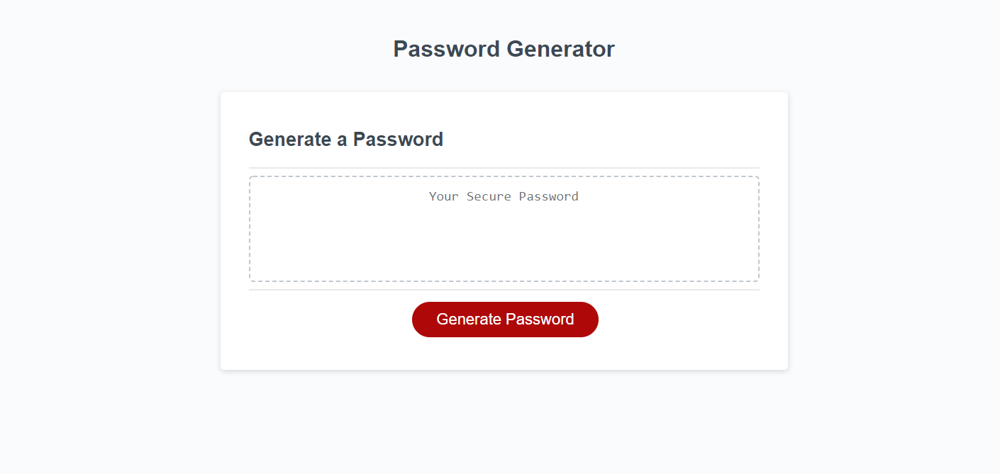

# Random Password Generator

This page generates a random password based on the user's responses to the following criteria:

- Length of the password (min-length: 8, max-length: 128)
- Allowing uppercase letters
- Allowing lowercase letters
- Allowing numerals
- Allowing special characters

The HTML, CSS and JavaScript starter files were provided by the bootcamp. Since the use of JavaScript is the main focus of this assignment, only the JavaScript file was modified.

:link: [Password Generator Website](https://angelicamapeso.github.io/bootcamp-random-pass-generator/)

## Purpose

Based on the given User Story of the assignment, this application was built for employees who have access to sensitive information and need a strong password.

## Main JavaScript Concepts Used

- Objects
- Arrays
- Loops (Do/while, while, for)
- Browser functions (prompt, confirm, alert)
